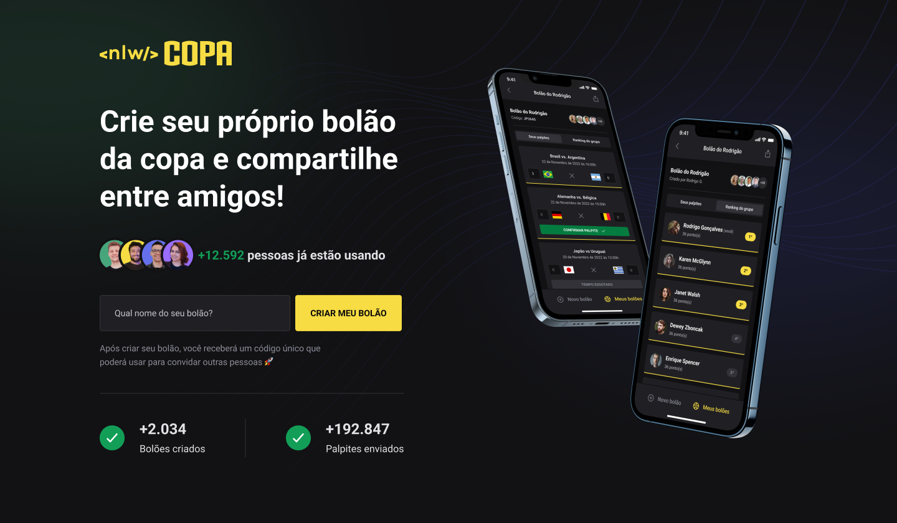

  

<h1 align="center">Seu Bolão da Copa do Mundo!</h1>

Projeto desenvolvido durante o NLW Copa da Rocketseat

  <a href="#-projeto">Projeto</a>&nbsp;&nbsp;&nbsp;|&nbsp;&nbsp;&nbsp;
  <a href="#-tecnologias">Tecnologias</a>&nbsp;&nbsp;&nbsp;|&nbsp;&nbsp;&nbsp;
  <a href="#-vídeo-demonstrativo-do-app">Vídeo Demonstrativo do App</a>&nbsp;&nbsp;&nbsp;|&nbsp;&nbsp;&nbsp;
  <a href="#-imagem-demonstrativa-da-web">Imagem Demonstrativa da Web</a>&nbsp;&nbsp;&nbsp;|&nbsp;&nbsp;&nbsp;
  <a href="#-como-executar">Como executar</a>

## 💻 Projeto

O projeto NLW Copa consiste em uma aplicação mobile de Bolão da Copa do Mundo, onde é possível criar e buscar um bolão, assim como, enviar palpites para os jogos, visualizar o ranking dos participantes e convidar amigos para um bolão específico.

Além da aplicação mobile, também foi desenvolvida uma página web de apresentação e também criação de bolões.

## 🚀 Tecnologias

Este projeto foi desenvolvido com as seguintes tecnologias:

### Mobile
- [React Native](https://reactnative.dev/)
- [Native Base](https://nativebase.io/)
- [Expo](https://expo.dev/)
- [OAuth2](https://oauth.net/2/)
- [Axios](https://axios-http.com/ptbr/docs/intro)
- [TypeScript](https://www.typescriptlang.org/)

### Server/API
- [Node.js](https://nodejs.org/en/)
- [Fastify](https://www.fastify.io/)
- [Prisma](https://www.prisma.io/)
- [Zod](https://www.npmjs.com/package/zod)
- [JWT](https://jwt.io/)
- [TypeScript](https://www.typescriptlang.org/)

### Web
- [Next.js](https://nextjs.org/)
- [Tailwind](https://tailwindcss.com/)
- [Axios](https://axios-http.com/ptbr/docs/intro)
- [TypeScript](https://www.typescriptlang.org/)

## 🎬 Vídeo Demonstrativo do App

    

## 💻 Imagem Demonstrativa da Web

    

## 🚀 Como executar
1.  Clone o repositório: `git clone git@github.com:esiammd/nlw-copa.git`
2.  Acesse a pasta do projeto no seu terminal: `cd nlw-copa`
3.  Para cada um dos arquivos (mobile, server e web), acesse a pasta e instale as dependências (node_modules): `npm install`
4.  Para o servidor (pasta server):
    - Faça uma copia do arquivo `.env.example` e chame-a de `.env`.
    - Execute `npx prisma migrate dev` para rodar as migrations.
      - **Obs.:** Esse comando executará as seeds também.
    - Execute o comando: `npm run dev`
5.  Para a aplicação mobile (pasta mobile):
    - Crie um app no google para ter acesso ao OAuth2 (https://docs.expo.dev/guides/authentication/#google).
    - Faça uma copia do arquivo `.env.example` e chame-a de `.env` e informe o seu CLIENT_ID.
    - Alterar o endereço do arquivo `src/services/api.ts` colocando o IP da sua máquina.
    - Execute o comando: `npx expo start --tunnel`
      -  **Obs.:** Aqui você vai precisar ter instalado o aplicativo Expo, caso teste via mobile, ou Android Studio (caso Windows e Linux) ou Xcode (caso Mac) para testes via desktop.
6.  Para a aplicação web (pasta web):
    - Alterar o endereço do arquivo `src/lib/axios.ts` colocando o IP da sua máquina.
    - Execute o comando: `npm run dev`
